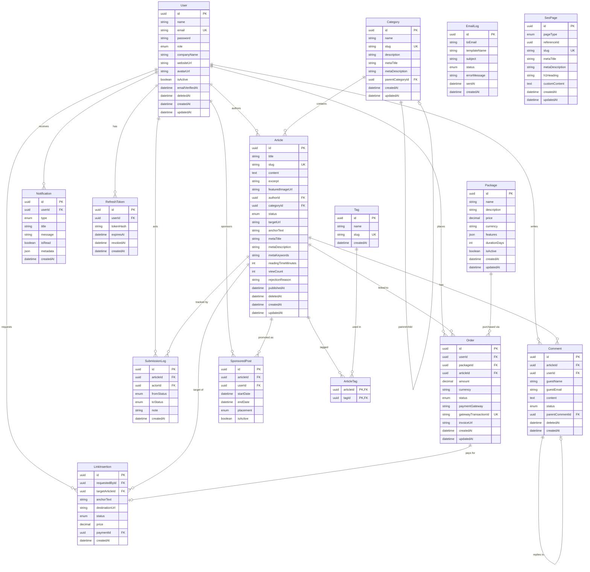

# Devsinn Insights — Entity Relationship Diagram

## Indexes

- `users.email` — unique
- `articles.slug`, `articles.status`, `articles.categoryId`, `articles.authorId`
- `categories.slug`, `tags.slug`, `seo_pages.slug`
- `orders.gatewayTransactionId` — unique (idempotent webhooks)
- `refresh_tokens.tokenHash`

## Cascade Rules

- User deletion cascades to articles, orders, notifications, refresh tokens
- Article deletion cascades to comments, submission logs, article tags
- Category/tag deletion sets null on article FK or cascades join table rows
